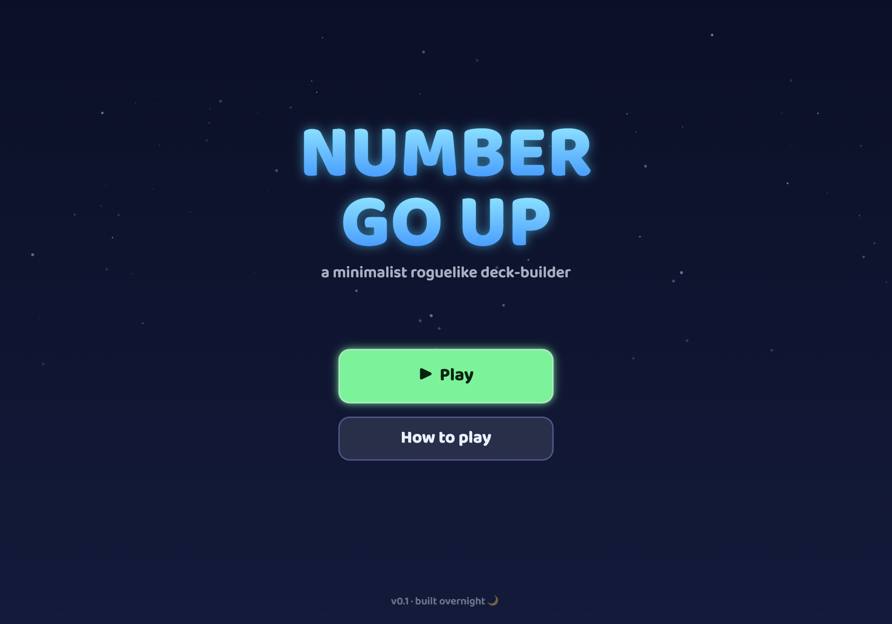
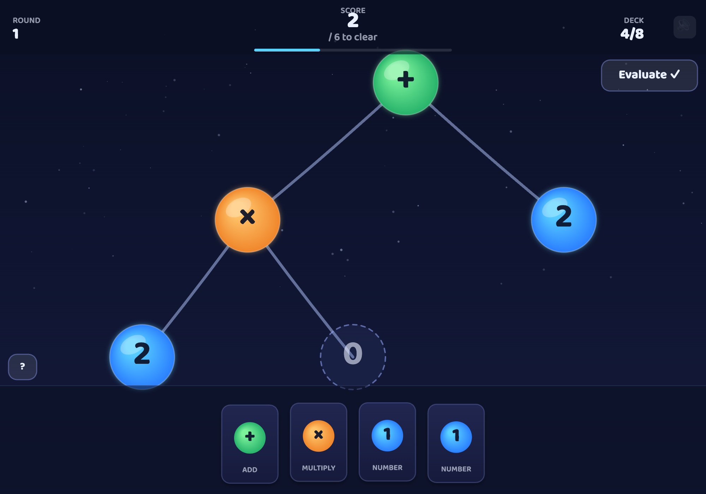
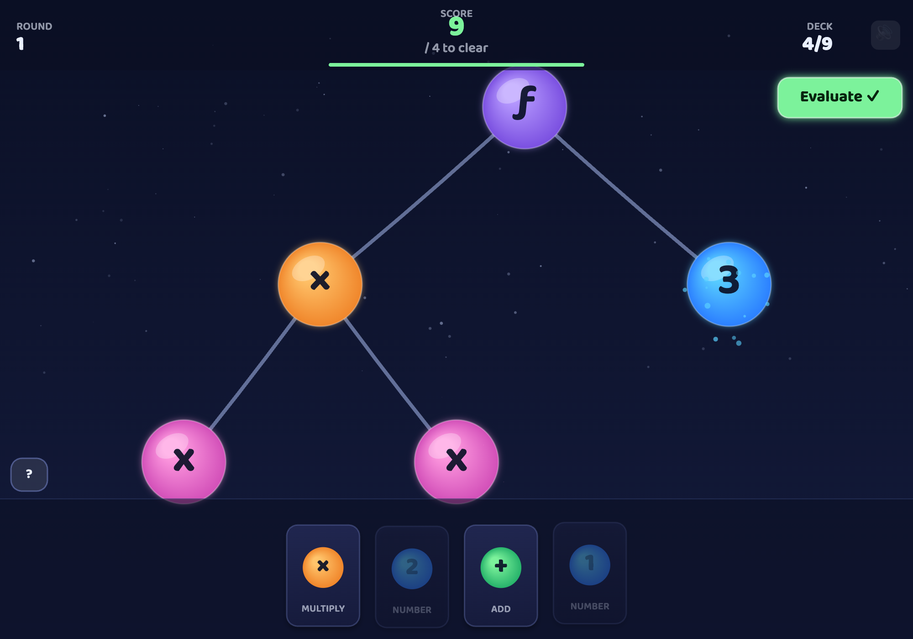

# Number Go Up 🫧

A minimalist **roguelike deck-building** game about building an arithmetic
syntax tree to make the number go up. Draw cards, drag glowing bubbles into a
tree, and finalize to watch the bubbles merge into your score. Clear the round,
upgrade your deck, and see how far the number will go.

> Built overnight as an end-to-end rewrite of an earlier CLI prototype. See
> [`docs/DESIGN.md`](docs/DESIGN.md) for the decisions behind it and
> [`QUESTIONS.md`](QUESTIONS.md) for open questions to review.




There are two modes, chosen from the title screen:
- **Classic** — numbers and `+`/`×` (the original spec).
- **Functions** — adds the variable `x` and an evaluate operator `ƒ`, so you can
  build a polynomial and evaluate it at a point: `ƒ(x×x, 3) = 9`.



## Quick start

```bash
npm install
npm run dev       # open the printed localhost URL
```

Other scripts:

```bash
npm run build       # type-check + production build into dist/
npm run preview     # serve the production build
npm test            # run the core-logic unit tests (Vitest)
npm run screenshots # capture every screen at mobile + desktop for a visual check
npm run icons       # regenerate the app icons (NGU bubble) into public/
npm run deploy      # build + publish the web version to nkohen.github.io
```

Because the whole UI is drawn on a canvas, unit tests can't catch layout
regressions. Before publishing a rendering/layout change, run `npm run
screenshots` and eyeball the results — see
[`docs/visual-testing.md`](docs/visual-testing.md) for what to check (and the
one iOS case that needs a real device).

The production build in `dist/` is a fully static bundle — host it anywhere
(GitHub Pages, Netlify, an S3 bucket) or just open it.

## Install as an app (PWA)

The game is an installable, offline-capable [PWA](https://web.dev/progressive-web-apps/).
From the live URL on a phone:

- **Android/Chrome:** tap the install prompt, or ⋮ menu → *Install app / Add to
  Home screen*.
- **iOS/Safari:** Share → *Add to Home Screen* (iOS shows no automatic prompt).

Installed, it launches full-screen with its own icon and **works offline** (the
bundle and the Baloo 2 font are cached by a service worker). Updates are
**opt-in**: when a new version is deployed, the running app shows a *"A new
version is available — Reload"* toast rather than swapping mid-play. PWA setup
lives in [`vite.config.ts`](vite.config.ts) (VitePWA) and
[`src/pwa.ts`](src/pwa.ts); icons are generated by
[`scripts/make-icons.mjs`](scripts/make-icons.mjs).

## How to play

1. **Draw.** Each turn you draw 5 cards from your deck.
2. **Play one.** Drag **one** card onto a glowing bubble; the rest of your hand
   shuffles back into the deck for next turn.
   - **Number cards** (`1`, `2`, …) fill an empty `0` slot.
   - **`+` / `×` cards** split a number into `(number ○ 0)`, sprouting a fresh
     `0` to fill.
3. **Mind the zeros.** An unfilled `0` is worth 0 — and `× 0` zeroes out the
   whole branch, so fill your multiplications!
4. **Auto-resolve.** The round scores itself the moment you clear the target
   (playing on would only overshoot) or run out of legal moves. The tree
   collapses bottom-up into a single number: your score.
5. **Clear & upgrade.** Beat the target to clear the round and pick one of three
   deck upgrades (add a card, thin a weak card, or promote a number). Targets
   keep rising — the run ends when you fall short.

In **Functions mode** there are two extra cards: `x` (a variable leaf that fills
a `0`-slot) and `ƒ` (evaluate). Playing `ƒ` on a leaf makes `ƒ(F, a)` — the left
side `F` is a polynomial that may use `x`, and the right side `a` is the point to
evaluate it at. Outside any `ƒ`, `x` is 0. See
[`docs/GAME_DESIGN.md`](docs/GAME_DESIGN.md#functions) for the full rules.

Controls: **drag** to place cards, **click** buttons, `M` to mute, `Enter`/`Space`
to Play / restart.

## Project layout

```
src/
  core/       Pure game logic (no DOM) — fully unit-tested
    rng.ts        Seeded deterministic RNG (mulberry32)
    cards.ts      Card model + starter deck
    tree.ts       The arithmetic syntax tree: placement, evaluation, legality
    upgrades.ts   Deck-upgrade ("shop") mechanic
    game.ts       Run/round state machine
  audio/
    sound.ts      Procedural Web Audio sound effects (no asset files)
  render/
    layout.ts     Tidy binary-tree layout
    animation.ts  Easing + the "evaluate" merge-animation sequencer
    renderer.ts   Canvas drawing: bubbles, edges, particles, HUD, widgets
  ui/
    app.ts        Game loop, input/drag-and-drop, screen flow
  main.ts       Entry point
tests/          Vitest unit tests for the core
docs/           Design, game-design, and architecture notes
legacy-rust/    The original Rust CLI prototype, kept for reference
```

See [`docs/ARCHITECTURE.md`](docs/ARCHITECTURE.md) for how the pieces fit together.

## Tech

TypeScript + Vite + an HTML5 Canvas renderer, with Vitest for the core logic.
No game engine, no runtime dependencies. The reasoning behind this stack (and
why not Rust/WASM, which the original prototype targeted) is documented in
[`docs/DESIGN.md`](docs/DESIGN.md#1-technology-stack).
